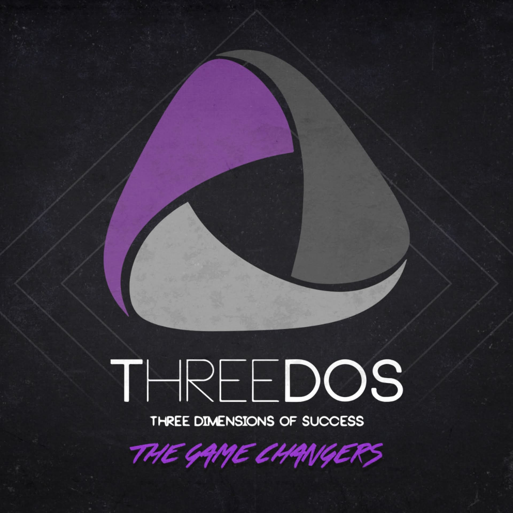

<div align="center">
  <br />
  
  <br />

  # ThreeDOS Backend Tasks
  **Backend Delegate Task Submissions**

  <br />

  
  
  

</div>

<br />

---

<br />

This repository stores all my task submissions and deliverables as a Backend delegate at **ThreeDOS**.

Every folder under `tasks/` corresponds to a single session. Each session contains the task brief and its associated solution or documentation. Nothing more, nothing is carried here that does not belong to a submitted task.

---

##  Structure

```
threedos-backend/
│
├── README.md
├── .gitignore
│
└── tasks/
    └── task-04/
        ├── task.md
        ├── diagrams/
        └── backend/
```

Each `task-XX` folder is self-contained. The `task.md` file describes the assignment. The solution files contain the actual work: scripts, schemas, or any documentation the task required.

---

##  Task Index

| Task Folder | Task Name | Tech / Format | Notes                                      |
| ----------- | --------- | ------------- | ------------------------------------------ |
| tasks/task-04 | Organizo Platform | PHP / PDO / CSS | Full CRUD with Priority Filtering & Archiving |

---

##  About ThreeDOS

ThreeDOS is a student-run initiative that replicates the structure and expectations of a professional software company. Members are assigned to functional departments (backend, frontend, design, product) and deliver real work under real constraints. The goal is to close the gap between academic learning and industry readiness.

---

##  Author

**Ahmed Elsayed**
Backend Development Delegate @ ThreeDOS
[github.com/AhmedTyson](https://github.com/AhmedTyson)
