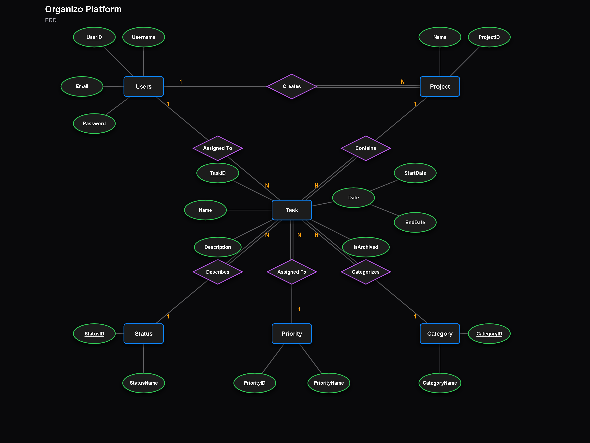
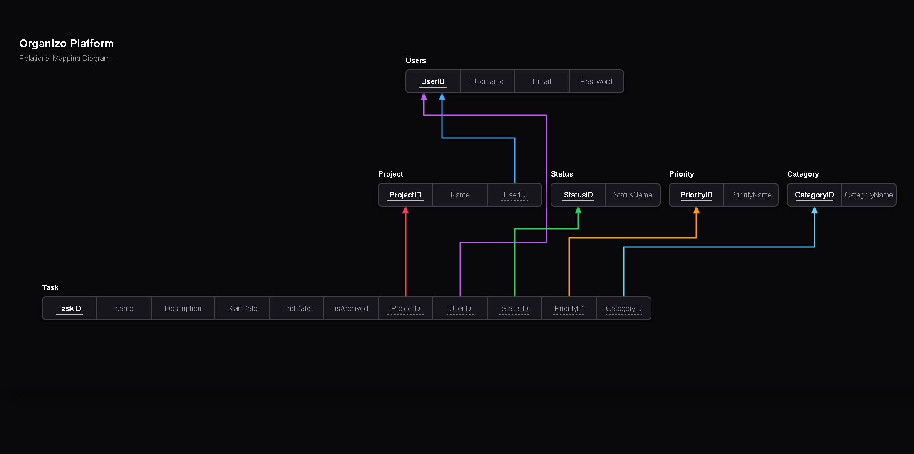
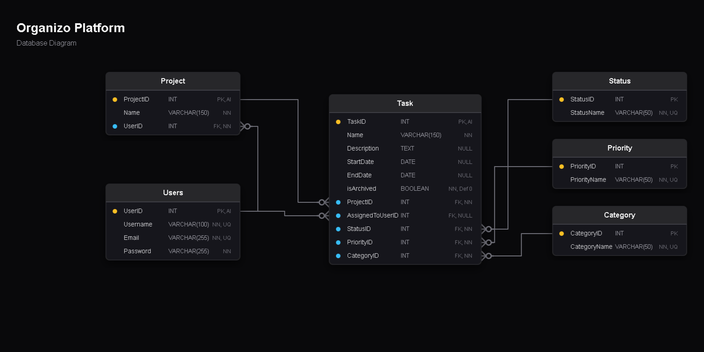

#  Task 04: Organizo Platform

##  Brief

Organizo is a web-based productivity platform that helps users organize their work by grouping tasks into projects.

Every user on the platform can create as many projects as they need. Each project has a name and belongs to exactly one user. Inside each project, the user can create tasks to track their work. A task has a name, a description, a start date, an end date, a priority (High, Medium, or Low), a category (Bug or Fix), and a status (To Do, In Progress, or Done). Tasks also have an archived flag instead of permanently deleting a task, a user can archive it to hide it from their view without losing it.

Every task belongs to exactly one project, and a project can contain many tasks.

---

##  Deliverables

### Q1: ERD
> **Objective:** Draw the Entity Relationship Diagram for the Organizo system.

**Status:** Completed 

Here are the architectural diagrams I designed to model the Organizo platform:

**1. Conceptual ERD (Chen Notation)**

**2. Relational Mapping Schema**

**3. Physical Database Diagram (Crow's Foot Notation)**

---

### Q2: Database
> **Objective:** Create the full database with all tables, constraints, and the correct data types. For the columns that have a fixed set of possible values — search for the data type in MySQL and use it where it applies.

**Status:** Completed 

The database schema is complete and matches the physical ERD above. The final SQL export with all tables, constraints, and exact types is available here:
 **[`backend/organizo_platform.sql`](backend/organizo_platform.sql)**

---

### Q3: Insert a Project and a Task
> **Objective:** Write a PHP code snippet using PDO that:
> - Receives a project name and user id and inserts a new project
> - Receives all task fields and inserts a new task linked to that project
> - Uses prepared statements and placeholders to prevent SQL injection

**Status:** Pending  (To be completed later)

---

### Q4: Fetch User Data
> **Objective:** Write a PHP code snippet using PDO that fetches all projects belonging to a specific user, along with all the tasks inside each project. The result should come back in a single joined query. (in human readable way)

**Status:** Pending  (To be completed later)

---

### Q5: Filter Tasks by Priority
> **Objective:** Write a PHP code snippet using PDO that:
> - Receives a user id and a priority value from user input
> - Returns all non-archived tasks for that user matching the given priority
> - Uses prepared statements and placeholders

**Status:** Pending  (To be completed later)
