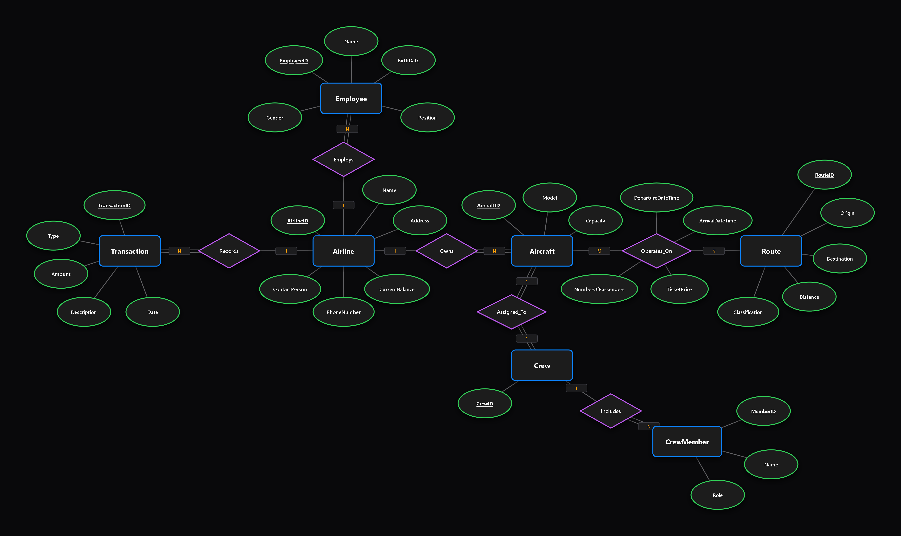
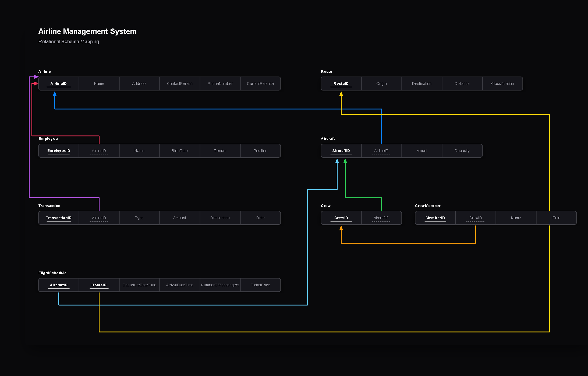
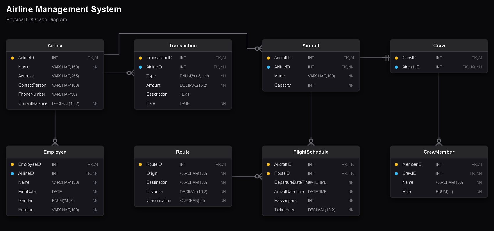

#  Task 05: Airline Management System

##  Brief

An airline company needs a database to manage its operations. The system stores information about airlines, including an airline ID, airline name, address, contact person, phone number, and current balance. Each airline employs many employees, and for every employee, the system stores an employee ID, name, birth date, gender, position, and the airline they work for.

Each airline owns multiple aircraft. For every aircraft, the system stores an aircraft ID, model, capacity, and the airline that owns it. Each aircraft has one assigned crew consisting of one major pilot, one assistant pilot, and two hostesses. Crew members are stored separately from employees, and one crew is assigned to only one aircraft.

Aircraft operate on routes. Each route has a route ID, origin, destination, distance, and classification, such as domestic or international. Because one aircraft can operate many routes, and one route can have many aircraft. For each aircraft assigned to a route, the system records departure date and time, arrival date and time, number of passengers, and ticket price.

The airline also records financial transactions. Each transaction has a transaction ID, transaction type (buy or sell), amount, description, date, and belongs to one airline. Sell transactions may represent ticket sales, while buy transactions may represent maintenance or operating costs.

---

##  Deliverables

### Part 1: ERD
> **Objective:** Design an ERD based on this case study, showing all entities, attributes and relationships.

**Status:** Completed 

Here are the architectural diagrams designed to model the Airline Management System:

**1. Conceptual ERD (Chen Notation)**


**2. Relational Mapping Schema**


**3. Physical Database Diagram (Crow's Foot Notation)**


---

### Part 2: PHP PDO REST API
> **Objective:** Build a complete RESTful API with the following endpoints, using PDO prepared statements, try-catch error handling, proper status codes, and JSON responses.

**Status:** Completed 

#### Airlines
- `GET /airlines` -- Get all airlines
- `GET /airlines?id=` -- Get airline by ID
- `GET /airlines?name=` -- Search by name
- `POST /airlines` -- Create airline
- `PATCH /airlines?id=` -- Partial update
- `DELETE /airlines?id=` -- Delete airline

#### Employees
- `GET /employees` -- Get all employees
- `GET /employees?name=` -- Search by name
- `POST /employees` -- Register employee
- `DELETE /employees?id=` -- Remove employee

#### Aircraft
- `GET /aircraft` -- Get all aircraft
- `POST /aircraft` -- Add aircraft
- `DELETE /aircraft?id=` -- Remove aircraft

#### Routes and Scheduling
- `GET /routes` -- Get all routes
- `POST /routes` -- Create route
- `POST /assign-route` -- Schedule flight (assign aircraft to route)
- `GET /flight-schedules` -- Get all scheduled flights

#### Transactions
- `GET /transactions` -- Get all transactions
- `POST /transactions` -- Execute transaction (uses `beginTransaction` for ACID compliance)
- `GET /transactions/summary` -- Aggregated financial summary

#### Crews
- `GET /crews` -- Get all crews with members
- `POST /crews` -- Assign crew to aircraft (validated: 1 Major Pilot, 1 Assistant Pilot, 2 Hostesses)
- `DELETE /crews?id=` -- Disband crew

**Source code:**
 **[`backend/`](backend/)**

**Database schema:**
 **[`backend/database/airline_db.sql`](backend/database/airline_db.sql)**

**Postman collection:**
 **[`backend/Airline Management System API.postman_collection.json`](backend/Airline%20Management%20System%20API.postman_collection.json)**

---

### Architecture

```
backend/
|
|-- config/
|   +-- database.php
|
|-- Controllers/
|   |-- AirlineController.php
|   |-- AircraftController.php
|   |-- CrewController.php
|   |-- EmployeeController.php
|   |-- RouteController.php
|   +-- TransactionsController.php
|
|-- helper/
|   |-- db.php
|   |-- request.php
|   |-- response.php
|   +-- status.php
|
|-- repos/
|   |-- AirlineRepo.php
|   |-- AircraftRepo.php
|   |-- CrewRepo.php
|   |-- EmployeeRepo.php
|   |-- RouteRepo.php
|   +-- TransactionsRepo.php
|
|-- routes/
|   +-- api.php
|
+-- database/
    +-- airline_db.sql
```

---

### Notes
- All SQL queries use PDO prepared statements with bound parameters
- All endpoints return structured JSON with `status_code`, `message`, and `data`
- ENUMs used for `Gender` (M/F), `TransactionType` (buy/sell), `CrewRole` (Major Pilot/Assistant Pilot/Hostess), and `Classification` (Domestic/International)
- Transaction endpoint uses `beginTransaction` / `commit` / `rollBack` for atomicity
- Strict input validation on all POST and PATCH endpoints
- Architecture follows Router -> Controller -> Repository separation of concerns
