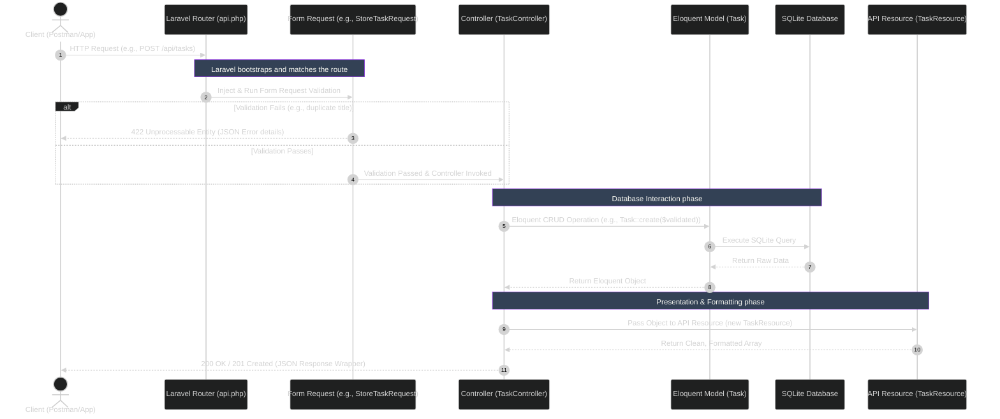
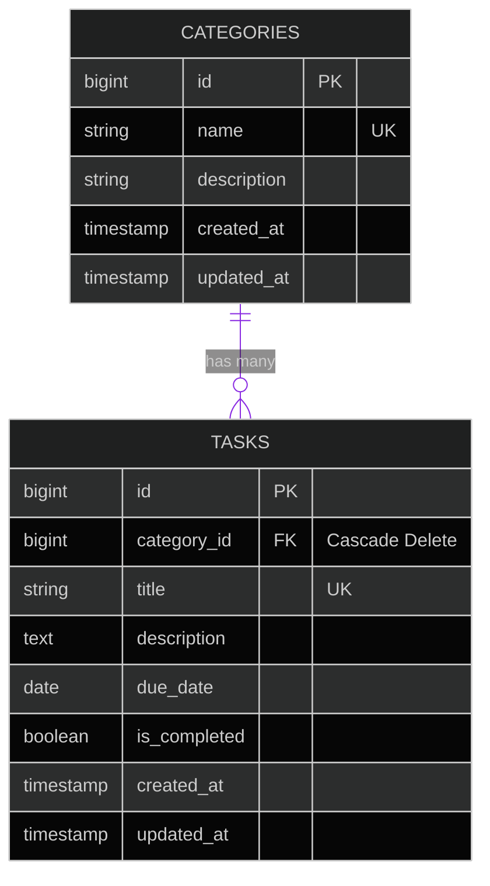

#  Session 8 — Task: To-Do List Management System

##  Table of Contents
1. [Overview](#-overview)
2. [System Requirements](#-system-requirements)
3. [Architecture & Technical Decisions](#-architecture--technical-decisions)
4. [Database Entity-Relationship Diagram](#-database-entity-relationship-diagram)
5. [Request Lifecycle Architecture](#-request-lifecycle-architecture)
6. [Setup & Operations (Runbook)](#-setup--operations-runbook)
7. [API Documentation](#-api-documentation)
8. [Postman Collection](#-postman-collection)

---

##  Overview
In this task, you will build a To-Do List Management API from scratch using Laravel. This is your opportunity to apply everything covered in today's session — migrations, models, controllers, routing, and Eloquent — independently and without guidance.

---

##  System Requirements
You are required to build a RESTful API for a To-Do List system consisting of two modules:
- **Category** — organizes tasks into groups
- **Task** — represents a single to-do item belonging to a category

**Rules:**
- No authentication or role management is required
- All API responses must be returned in JSON format
- All database interaction must be handled exclusively through Eloquent ORM — raw SQL queries are not accepted
- Database tables must be created using Laravel Migrations — no manual table creation in phpMyAdmin

---

##  Architecture & Technical Decisions
This project was built focusing on clean architecture, maintainability, and standard Laravel best practices.

###  Folder Structure & Developed Components
*    **`database/migrations/`**
    *   *What:* Contains the schema definitions for `categories` and `tasks`.
    *   *Why:* Ensures database structures are version-controlled and reproducible across any environment without manually touching SQL.
*    **`database/seeders/`**
    *   *What:* Contains `CategorySeeder` and `TaskSeeder`.
    *   *Why:* Instantly populates the database with realistic dummy data for testing and debugging.
*    **`app/Models/`**
    *   *What:* Contains `Category.php` and `Task.php`.
    *   *Why:* Defines the Eloquent ORM relationships (One-to-Many) and protects against mass-assignment vulnerabilities using the `$fillable` array.
*    **`app/Http/Controllers/`**
    *   *What:* Contains `CategoryController` and `TaskController`.
    *   *Why:* Handles the core API routing logic, returning standardized JSON responses.
*    **`app/Http/Resources/`**
    *   *What:* Contains `CategoryResource` and `TaskResource`.
    *   *Why:* Acts as a transformation layer between the database and the JSON response.

###  Why Form Requests (Validation Folder)?
Instead of writing validation rules directly inside the Controller, validation was extracted into dedicated Form Request classes located at  **`app/Http/Requests/`**.
*   **Separation of Concerns:** Controllers only handle receiving the request and returning the response. 
*   **Automatic Error Handling:** Form Requests automatically intercept bad data before the controller even runs, instantly returning a standard `422 Unprocessable Entity` JSON error.

###  External Tooling & Integration
*   **Apidog (API Documentation):** Used to generate beautiful, interactive documentation pages directly from the imported JSON collection, bridging the gap between backend and frontend.
*   **Laravel Telescope (with Custom Vue UI):** An elegant debug assistant embedded directly into the application. This project utilizes a custom Vue 3 fork of the Telescope dashboard to monitor SQLite queries, catch exceptions, and inspect payloads in real-time.

---

##  Request Lifecycle Architecture

---

##  Database Entity-Relationship Diagram

---

##  Setup & Operations (Runbook)
1. Clone the repository and navigate to the backend folder.
2. Install dependencies: `composer install`
3. Start the server: `php artisan serve`
4. **Wipe & Seed Database:** To instantly set up the database with dummy data for testing, execute a `GET` request to:
   `http://127.0.0.1:8000/api/setup/seed`

---

##  API Documentation
*For full payload examples and detailed endpoint constraints, see the exported Postman Collection.*

### Categories Module (`/api/categories`)
*   `GET /categories` - Retrieves a list of all categories.
*   `POST /categories` - Creates a new category.
*   `GET /categories/{id}` - Retrieves details for a specific category.
*   `PUT /categories/{id}` - Updates an existing category.
*   `DELETE /categories/{id}` - Deletes a category (Cascades and deletes all associated tasks).

### Tasks Module (`/api/tasks`)
*   `GET /tasks` - Retrieves a list of all tasks.
*   `POST /tasks` - Creates a new task.
*   `GET /tasks/{id}` - Retrieves a specific task.
*   `PUT /tasks/{id}` - Updates an existing task.
*   `DELETE /tasks/{id}` - Permanently removes the task.

###  Error Handling
| Status Code | Description & Resolution |
| :--- | :--- |
| **`200 OK`** | Request succeeded. |
| **`201 Created`** | A new resource was successfully saved. |
| **`404 Not Found`** | The provided `id` in the URL does not exist. |
| **`422 Unprocessable`** | Validation failed. The response includes an `errors` object mapping exactly which fields failed. |
| **`500 Server Error`** | Unhandled database or code exception. |

---

##  Postman Collection
A fully configured Postman Collection JSON file has been generated for this project. 
 **File:** `ToDoList_Postman_Collection.json`

**How to Import to Apidog:**
1. Open Apidog and click **Import Data**.
2. Select **Postman** as the format.
3. Drag and drop the `ToDoList_Postman_Collection.json` file.
4. Set "Import Mode" to **Overwrite existing** (to prevent duplicates).
5. Click **Import**.
